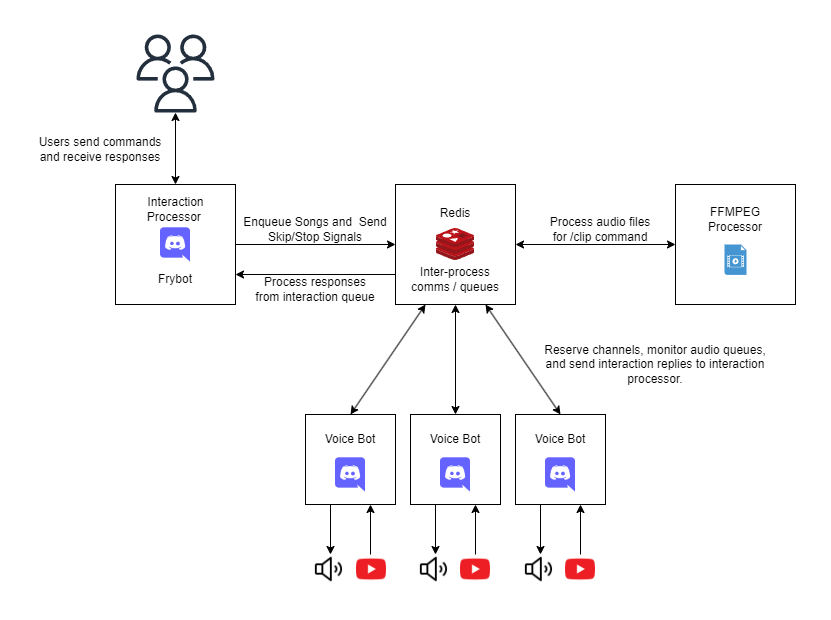

# frybot

A distributed discord music bot system

## Why would you need multiple bots?

Discord limits a user to one voice channel connection at a time. Bots are just users, so they're subjected to this restriction, which means they're limited to playing music in one channel at a time. However, because bots are added to each guild as a unique user, a single bot client can play music in 1 channel at a time per guild. 

We can get around this limitation by using multiple bots. For example, if we have 3 voice bots in the system, then we can play music in 3 channels at a time per guild. Voice bots coordinate via redis to reserve channels automatically, so adding more bots to the system is as simple as spinning up another docker container and connecting it up to redis. This also allows us to distribute bots across multiple servers using some sort of container orchestrator (Nomad or Kubernetes for example). 

## Architecture

Frybot is a discord bot system primarily used to play music (stay tuned for new features). The system is composed of a group of individual discord bots working together to provide music in multiple channels at the same time. 

  

### Interaction Processor

The interaction processor handles all user interaction. It waits for ChatInputCommand interactions, processes user input, and adds any jobs to the appropriate queue in redis for future processing (more on the redis structure here). The processor also internally stores all interactions for 15 minutes (this is a discord limit). It watches redis for any responses from other bots and uses the stored interactions to forward the response to discord.   

#### List of commands:

- `/play` - Adds a song to the channel's queue for voicebots to process.
- `/play-many` - Adds a list of youtube links to the channel's queue for voicebots to process.
- `/stop` - Sends a signal to redis which triggers the voicebot to stop and delete the queue.
- `/skip` - Sends a signal to redis which triggers the voicebot to skip to the next song.
- `/clip` - Clip a youtube video and return the audio. Useful for creating soundboard entries. (In progress)

### Voice Bots

Voice bots watch redis for discord channels that have an active queue but no voice bot playing music. This type of channel will be referred to as an ***open channel***. Bots use redis to coordinate the reservation of open channels amongst themselves. A channel that has an active voice connection is called a ***reserved channel***. Only one bot connects to a channel at a time.

Each bot can reserve multiple channels (as long as they're in separate guilds - [See here](#why-would-you-need-multiple-bots)), and will watch those channels for queued music. If there is a song in the queue, the bot will download the required audio data and stream it to discord. This is currently done using youtube, but the aim is to make this modular enough to switch youtube out with whatever media provider a user wants. Bots will clean up audio resources if a queue has been empty for a configurable amount of time.

Voice bots are subscribed to stop and skip command events, so redis will trigger a function in the voice bot to handle this when the command is sent to the interaction processor. 

### FFMPEG Processor

This component is used for the `/clip` command to process video data. Having it as a separate component allows us to offload CPU intensive video processing somewhere else.

### Custom Components

This is a distributed application that uses queues, so theoretically custom components can do anything. They just need to properly interface with the queue system and register commands with the interaction processor.

## Notes

Constructive criticism is encouraged. 

